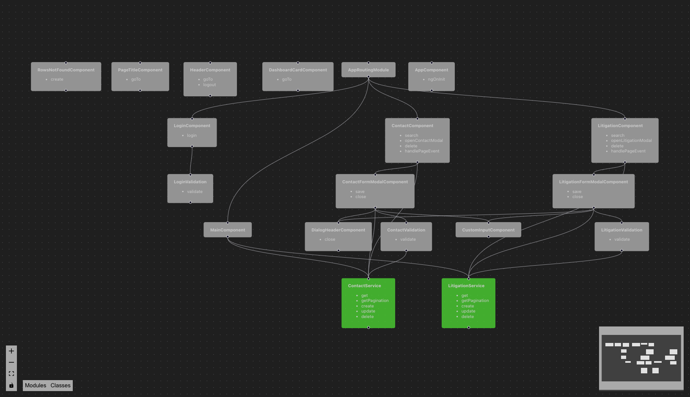

# FreelawTest
#
# Orientações para execução do projeto

## Executando o projeto

A parte de execução do projeto mantem a mesma da documentação do Angular

```
#Agular version 17.*
#Node version 18.* - 20.*

ng start
```

## Tela de Login

O login na aplicação é uma tela falsa, basta adicionar um texto do tipo email e digitar qualquer senha, ele adiciona esses dados em um `localStorage`e valida se está preenchido para direcionar para a tela principal, se não estiver preenchido ele retorna para o login. Exemplo:

```
#Email
joao.das.couve@agro.com
#Senha
joazinho123
```

# Descrição do Projeto Criado

## Arquitetura

A arquitetura proposta respeita a independencia entre as camadas da aplicação e dos contextos, cada funcionalidade tem seu contexto e os componentes filhos, nesse caso os `Dialogs`, são utilizados somente no componente pai.

Componente em comum, serviços e validações, estão localizados na pasta `Shared` e podem ser utilizados por toda aplicação.

Os componentes compartilhado dentro da pasta `Shared` tornam o layout mais padronizado, além de facilitar alterações globais, como aplicação de acessibilidade, sem ter a necessidade de percorrer o projeto todo.

Foi criado uma pasta para armazenar os arquivos de estilização global do projeto, com a adição de mais dois arquivos, o `_utilities` e o `_typography`.

Segue a visualização da arquitetura final



## Tela Selecionada

### Tela de Contatos

A tela de contatos foi pensada de forma básica, os campos foram escolhidos para demonstrar aplicação de máscara.

### Tela de Processos

Os campos da tela de processos foram selecionados com base na página de consulta de processo do PJE do TJMG.

## Utilização do RxJs

O RxJs foi utilizado no tratamento dos dados falsos e na consulta do filtro de texto para controlar o debounce e fazer a consulta a medida que o usuário digita o termo a ser consultado.

## Utilização do Angular Material

Busquei implementar uma solução que fosse um misto com o Angular Material. Gosto do Material como ferramenta de desenvolvimento para ser utilizado a curto ou médio prazo do projeto, por ser prático e ter uma boa documentação, mas o desenvolvimento de soluções próprias pode ser melhor a médio ou longo prazo.

## Responsividade

A aplicação possui elementos responsivos, as melhores telas para ver o elemento responsivo mudando de maneira mais relevante são, a tela principal com os cards e os modais de cadastro/edição.

## Nova Funcionalidade

Adicionei ao projeto uma tela principal que consiste em um dashboard que mostra a quantidade de registro em cada tela, além disso adicionei um campo de busca textual em cada tela de listagem

## Design de Interface

Procurei trazer algo que fosse moderno e atraente na tela de login, mas que após logado não fosse tirar a atenção do usuário das tarefas dele, o cabeçalho ainda usa uma estrutura de cores semelhante ao login, mas de maneira mais reduzida, apenas para trazer o charme e modernidade.

## Experiência do Usuário

Todos os campos de input e button possuem elementos de acessibilidade, que respeitam pontos levantados pela cartilha de acessibilidade da W3C, é possível fazer a navegação de teclado e utilizar um leitor de tela, além disso os botões funcionam com o uso da tecla Enter durante a navegação via teclado.

Os textos estão descrito de maneira simples, objetiva e clara, para a melhor compreensão dos usuários.


#
#
#
# Documentação do Angular


This project was generated with [Angular CLI](https://github.com/angular/angular-cli) version 17.3.3.

## Development server

Run `ng serve` for a dev server. Navigate to `http://localhost:4200/`. The application will automatically reload if you change any of the source files.

## Code scaffolding

Run `ng generate component component-name` to generate a new component. You can also use `ng generate directive|pipe|service|class|guard|interface|enum|module`.

## Build

Run `ng build` to build the project. The build artifacts will be stored in the `dist/` directory.

## Running unit tests

Run `ng test` to execute the unit tests via [Karma](https://karma-runner.github.io).

## Running end-to-end tests

Run `ng e2e` to execute the end-to-end tests via a platform of your choice. To use this command, you need to first add a package that implements end-to-end testing capabilities.

## Further help

To get more help on the Angular CLI use `ng help` or go check out the [Angular CLI Overview and Command Reference](https://angular.io/cli) page.
